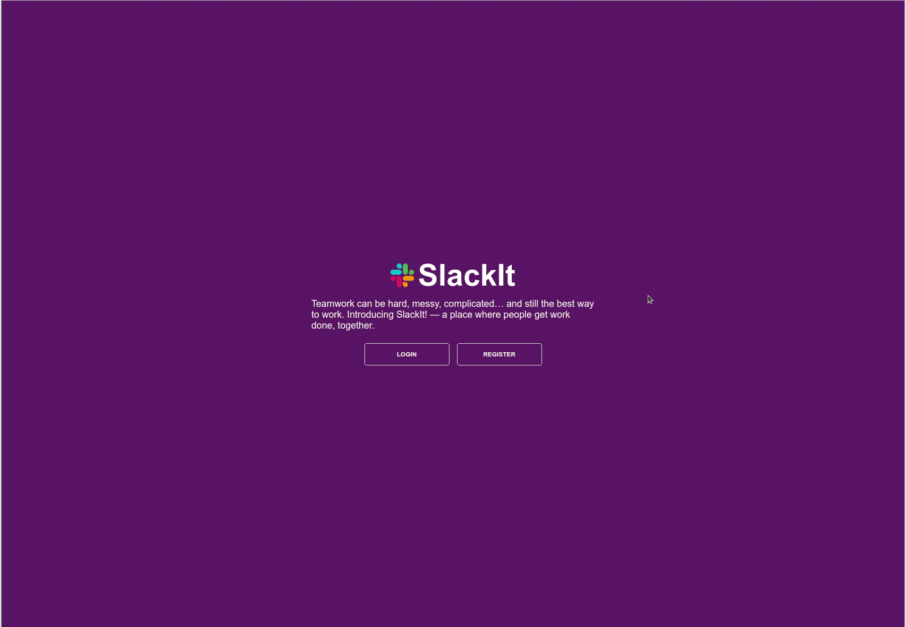

# SlackIt



Simple Slack lite clone for users to create teams and channels to collaborate via chat in real time.

## Tech Stack

- [Node.js](https://github.com/nodejs)
- [Express](https://github.com/expressjs/express)
- [TypeScript](https://github.com/Microsoft/TypeScript)
- [Redis](https://github.com/antirez/redis)
- [Postgres](https://github.com/postgres/postgres)
- [TypeOrm](https://github.com/typeorm/typeorm)
- [Type-Graphql](https://github.com/MichalLytek/type-graphql)
- [Apollo-Server](https://github.com/apollographql/apollo-server)
- [Docker](https://github.com/docker)
- [Next.js](https://github.com/vercel/next.js/)
- [Styled-Components](https://github.com/styled-components/styled-components)
- [Apollo-Client](https://github.com/apollographql/apollo-client)

---
## Getting Started

Dependencies needs to be installed from both directories. Run both of these commands from root directory.
`yarn` can be replaced with `npm i` if using npm is preferred.

```
$ cd client && yarn
```

```
$ cd server && yarn
```

Install PostgreSQL and create a new database instance for this project. If psql isn't installed, follow [installation guide](https://www.postgresqltutorial.com/install-postgresql/).

```
$ psql
$ CREATE DATABASE 'database name';
```

Install Redis and make sure redis server is running. [Redis installation](https://redis.io/topics/quickstart).

Start redis server:

```
$ redis-server
```

Check if Redis is working by sending a PING command using redis-cli:

```
$ redis-cli ping
```

Redis will send a response if its working correct with:

```
PONG
```

Both ```client``` and ```server``` directories require a ```.env``` file. Rename ```.env.example``` to ```.env``` and fill out the remaining required environment variables to run this project.

In server directory, rename ```ormconfig-example.json``` to ```ormconfig.json``` to match the database config to your ```psql``` configurations for this project.

To run this project create a seperate terminal window and run both of these commands from root:
* Replace ```yarn dev``` with ```npm run dev``` if using ```npm``

```
$ cd client && yarn dev
```

```
$ cd server && yarn dev
```

---
## Future development
- Responsive design for mobile
- Batching sequel queries for more optimization
- Private teams and channels
- Document (PDF, DOCS, etc) uploads (currently only supporting image docs)
- User status